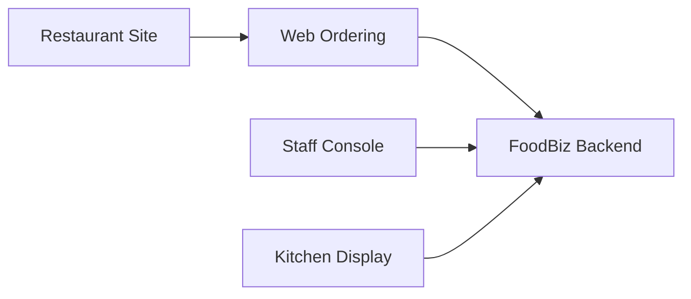

# Browser Surfaces

## Purpose

FoodBiz now splits browser products into separate operational surfaces instead of one mixed dashboard.

## Surfaces

### Restaurant site
- Public-facing shell
- Holds business-facing entry points only
- Links customers into `web-ordering` for pickup or delivery
- Excludes staff, session, and kitchen controls

### Web ordering
- Customer ordering surface
- Supports dine-in table context when a scan-aware table URL is present
- Supports pickup and delivery entry paths without staff UI leakage
- Uses location-aware ordering through `POST /v1/orders`

### Staff console
- Entrance and service operations surface
- Owns location awareness, open/close table occupancy workflows, and service-side follow-through
- Uses backend `locations` as the primary venue model and legacy table endpoints only where the current API still exposes summary/history there
- Excludes kitchen Accept and Ready controls by default

### Kitchen display
- Dedicated kitchen-prep surface
- Owns `Accept` and `Ready`
- Shows only active kitchen lanes: `PLACED`, `ACCEPTED`, `READY`
- Excludes floor management, host occupancy, and public ordering concerns

## Responsive shell behavior

### Staff console
- Large: three panes at once
- Medium: floor plus one secondary pane
- Narrow: stacked panes with queue/detail switching
- All major panes use independent scroll regions

### Kitchen display
- Large: three lane board
- Narrow: stacked lanes with each lane retaining its own scroll region

### Web ordering
- Customer-friendly page layout
- Entry context stays prominent at the top
- Pickup/delivery remain usable without dine-in URL context

## Known backend constraints
- Table history and summary are still exposed through legacy table routes.
- Generic location history endpoints do not exist yet.
- Staff console therefore uses `locations` for venue truth, plus table summary/history endpoints for table-backed detail.
