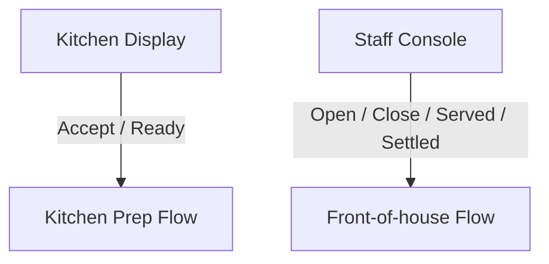

# Kitchen Display vs Staff Console

## Boundary

Kitchen and staff are now separate browser surfaces because they solve different operational problems.

## Kitchen display owns
- Active kitchen backlog
- Lane visibility for `PLACED`, `ACCEPTED`, and `READY`
- Accepting orders into prep
- Marking accepted orders ready for pickup or service handoff
- Modifier and note visibility for cooks and expediters

## Kitchen display intentionally excludes
- Opening or closing dining sessions
- Host or entrance occupancy workflow
- Venue floor awareness beyond the order's table/location label
- Bar-seat awareness as a floor-management concern
- Served and settled follow-through

## Staff console owns
- Live location awareness across dining tables, bar seats, and off-premise lanes
- Opening and closing table occupancy through current backend-compatible workflows
- Service-side order follow-through: `READY -> SERVED -> SETTLED`
- Entrance and service filtering, visibility, and recent table detail

## Staff console intentionally excludes
- Accepting new kitchen work
- Marking prep complete as a default service action
- Pretending bar seats run through the same backend-managed flow as dining tables

## Current compatibility bridge
- Backend `locations` and `sessions` are the domain truth after ROP-013.
- Table summary and order list routes still live under legacy table endpoints.
- Staff console therefore merges `locations` with legacy table summaries until generic location history routes are added.
