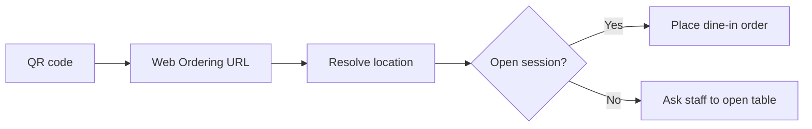

# Scan Order Entry

## Goal

Create a browser entry model that is compatible with future signed QR codes without making plain query-string table IDs the permanent security design.

## Current entry model

### Dine-in
- URL may include `tableId` and/or `locationId`
- Web ordering resolves that into a real backend `Location`
- Dine-in ordering only becomes orderable if the table's session is already open
- Customers do not silently create table occupancy by scanning

### Pickup / Delivery
- URL can set `mode=pickup` or `mode=delivery`
- These modes map to seeded operational locations:
  - `loc_online_pickup`
  - `loc_online_delivery`
- They do not require an open dining session

## Why this structure
- It removes manual free-text table entry as the primary dine-in path.
- It keeps pickup and delivery available as normal customer browser paths.
- It keeps staff in control of occupancy lifecycle.
- It leaves space for future signed QR tokens or opaque location tokens later.

## Deferred security hardening
This ROP does **not** claim that `tableId` in a query string is the final security model.

Future hardening options:
- signed table token
- opaque scan token that resolves server-side
- token expiry or rotation strategy

## Current fallback
A manual support override remains in the UI for local development and debugging, but it is intentionally downgraded behind a disclosure panel.
