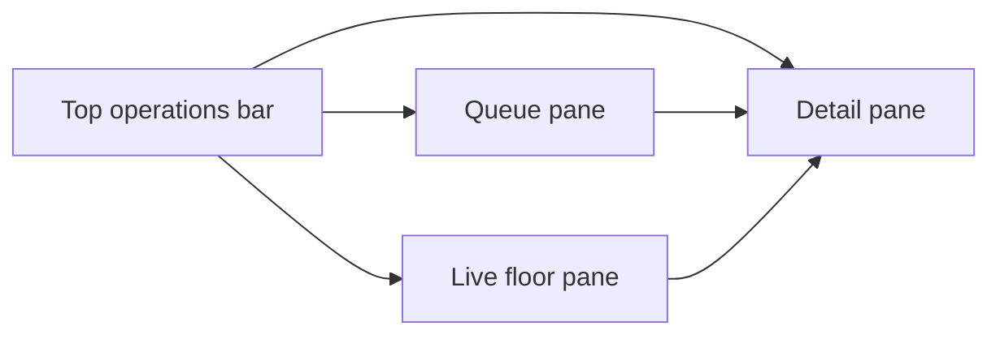

# Staff Console Browser Layout

## Purpose

The staff console is a browser-first operational surface for front-desk and service-station work.
It runs as the existing `frontend/apps/dashboard` app and adapts to laptop, desktop, tablet, or app-shell browser usage.

## Layout Model

### Large screens

- Three panes are visible at once.
- Left: operational queue.
- Center: floor/location view.
- Right: detail and actions for the selected location.

### Medium screens

- Floor pane remains visible.
- Queue pane and detail pane switch through a segmented control.
- This preserves access to every workflow without depending on hover or drag-and-drop.

### Narrow screens

- Floor pane renders first.
- Queue/detail secondary panes render underneath through the same segmented control.
- Core actions remain tap-friendly and keyboard-accessible.

## Information Architecture

1. Top bar
   - venue title
   - Entrance/Service mode switch
   - live connection state
   - available/open/attention/manual counts
   - search and filter controls
   - refresh action
2. Queue pane
   - mode-specific operational sections
   - entrance: available now, open sessions, turnover watch, bar overview
   - service: needs attention, ordering active, open and unassigned
3. Floor pane
   - grouped by zone instead of fixed pixel coordinates
   - generic location tiles for tables, kiosk tables, and bar seats
4. Detail pane
   - selected location metadata
   - session summary
   - recent orders and supported actions

## Location Strategy

The UI is built around generic service locations instead of a table-only layout.

Supported location types:

- `TABLE`
- `KIOSK_TABLE`
- `BAR_SEAT`

Current venue catalog is defined in `frontend/apps/dashboard/src/lib/locationCatalog.ts`.
That file is the only place where the initial location set is seeded for the browser UI.

## Why the floor is tile-based

The backend does not yet provide a persisted layout model with coordinates.
A zone-grouped tile map gives us:

- responsive rendering without fixed screen assumptions
- stable keyboard/touch navigation
- one place to adapt future venue layouts
- no drag-only dependency

## Responsive Implementation Notes

- `useViewportMode()` classifies the browser into `large`, `medium`, or `narrow`.
- `App.tsx` switches pane composition based on that mode.
- No action is hover-only.
- No workflow depends on touch gestures.

## Backend Compatibility Adapter

The console normalizes current backend reality at the UI boundary:

- table registry drives table/session state
- kitchen queue drives active order status across locations
- selected location detail uses table orders + table summary
- websocket order events update the shared order map
- websocket table events update session state

Known temporary adapters:

- bar seats are manual-only and not persisted in backend storage yet
- kiosk tables are represented in the browser catalog but reuse current table endpoints
- waiter assignment is not persisted, so service mode surfaces open sessions as unassigned
- HTTP order responses use `total`, while websocket order events use `totalMoney`; normalization happens in the dashboard adapter layer

## Next-step Compatibility

This structure is intentionally compatible with later work on:

- real venue layout persistence
- waiter assignment persistence
- kiosk client attachment to live sessions
- RBAC/auth gating around staff modes
- future tablet/mobile staff clients consuming the same backend model
