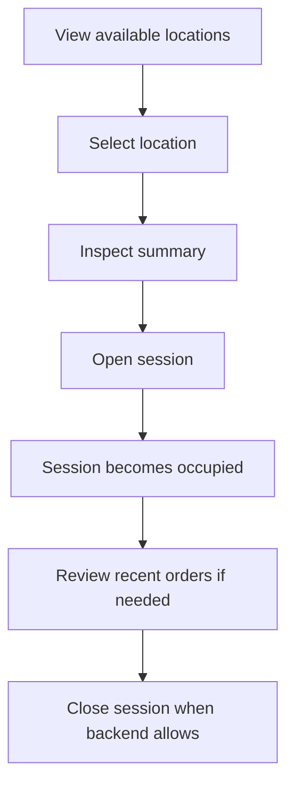
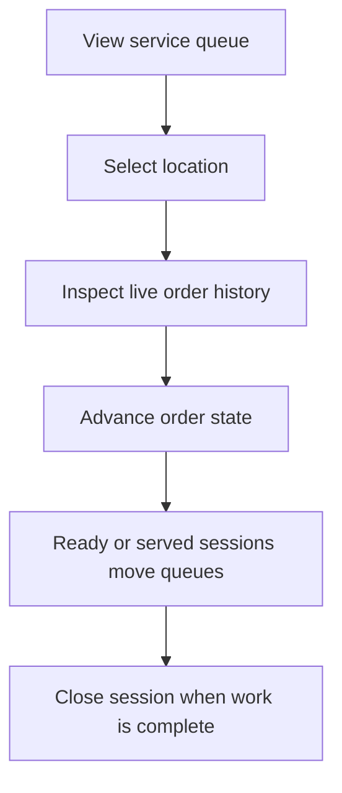

# Staff Console Workflows

## Entrance Mode

Entrance mode is optimized for host / front-desk work.

### Current supported actions

- inspect available and occupied locations
- open a session for a backend-managed location
- review current session summary
- review recent orders for the selected location
- close a session when no non-ready orders remain

### Current backend limitations surfaced honestly

- no persisted party size yet
- no waiting list / arrivals queue yet
- no persisted waiter assignment yet

The console still leaves room for those concepts in layout and copy, but does not fake persistence.

## Service Mode

Service mode is optimized for kitchen-adjacent and waiter-station workflow.

### Current supported actions

- inspect needs-attention sessions
- inspect active ordering sessions
- inspect open but unassigned sessions
- advance order status using current backend actions
  - Accept
  - Mark Ready
  - Mark Served
  - Mark Settled
- close session when backend guardrails allow it

## Queue Logic

### Entrance mode sections

- `Available now`: backend-managed locations with no open session
- `Open sessions`: currently open tables / kiosk tables
- `Turnover watch`: recently closed locations with recent order activity
- `Bar counter`: manual visibility for bar seats

### Service mode sections

- `Needs attention`: ready or served sessions
- `Ordering active`: placed / accepted / served work in progress
- `Open and unassigned`: sessions without persisted ownership

## Selection Rules

- Selecting a queue item or floor tile updates the detail pane.
- On medium/narrow viewports, selecting a location also flips the secondary pane to detail.
- If live data changes while a location is selected, the detail pane re-hydrates against that location.

## Failure Handling

The console explicitly handles:

- API unavailable: global degraded banner, panes still render their structural layout
- websocket disconnected: connection badge flips to disconnected
- no locations returned by filters: empty state in floor pane
- no session/orders for selected location: detail empty state
- malformed websocket payloads: ignored at adapter boundary
- narrow screens: queue and detail panes become switchable instead of simultaneously visible
- large bar seat count: seats remain grouped under a dedicated zone instead of overwhelming the whole layout

## Future Expansion Notes

These concepts are intentionally visible now so future work does not need a conceptual reset:

- true session model separate from open table state
- assignment / takeover persistence
- kiosk session linking
- mobile or tablet staff clients using the same API model
- RBAC gating for entrance vs service capabilities
